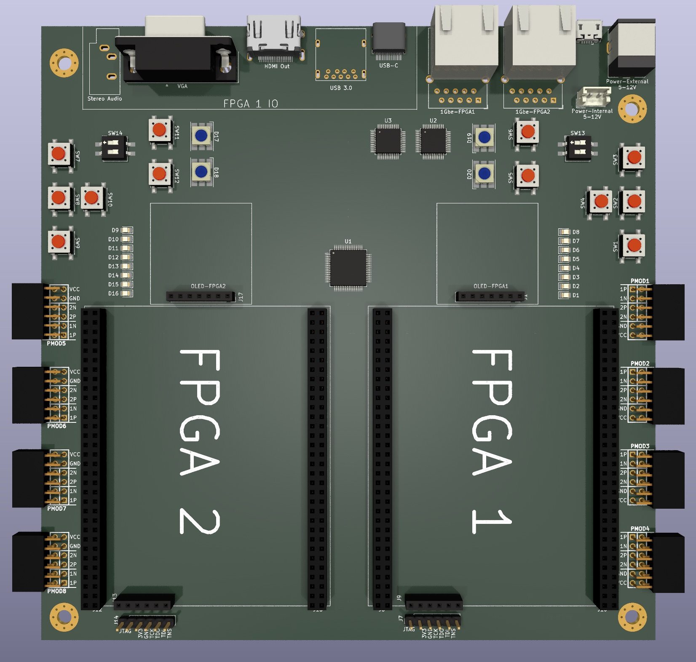

# QMTech Kintex 7 Motherboard

The objective of this project is to design a standard-size motherboard, initially in Mini-ITX size, to host dual Kintex 7 core boards from [QMTech](https://www.aliexpress.com/item/1005003668804223.html) and sold thru AliExpress.

The [QMTechBaseBoard](./QMTechBaseBoard-Kicad/) directory hosts Kicad files for the board design. We are still in draft phase and plan to close the design once the desired (and possible) peripherals have been defined.

The core board [manual](docs/QMTECH_Kintex-7_XC7K325T_Core_Board_User_Manual(Hardware)_V01.pdf) and [schematics](docs/QMTECH-XC7K325T-CORE-BOARD-V2-20211104.pdf) are provided. More information is available at <https://github.com/ChinaQMTECH/QMTECH_XC7K325T_CORE_BOARD>

Each QMTech Kintex 7 core board contains:

- Xilinx Kintex 7 XC7K325T FPGA
- 50Mhz crystal
- 256Mbit SPI Flash ([datasheet](docs/SPI/S25FL256L_S25FL128L_256-MB_32-MB_128-MB_16-MB_3.0_V_FL-L_FLASH_MEMORY.pdf)
- 256MB DDR3 RAM ([datasheet](docs/DDR3/2Gb_1_35V_DDR3L.pdf))
- 3 switches
- 4 LEDs
- JTAG Interface

## Project Plans

Initially we plan on getting feedback from the community about which features would be useful in a board like this. We expect getting the feedback thru Github issues. If you have some suggestion for a part to be added, some additional feature or general idea, please open an Issue and describe it.

Also when defined, we need feedback from the community about which part/vendor to use. This is important since it's affected by availability and price.

## Peripherals

Some initial peripherals to be added:

- Dual Kintex7 Core-boards from QMTech
- 8x PMOD (4 PMOD for each core-board) (32 pins)
- Serial-USB - Quad FTDI (FT4232) - one UART, one JTAG for each core-board (2 pins)
- JTAG connection for each core-board to baseboard
- Dual 1Gbe RGMII, one for each core-board (8 pins)
- Dual USB OTG 2.0 port, one for each core-board (2 pins)
- Dual USB HID 2.0 port, one for each core-board (2 pins)
- Dual HDMI Out, one for each core-board (8 pins + 4 pins??*)
- VGA Out (single) (5 pins)
- 6 buttons for each core-board (6 pins)
- 4 switches for each core-board (4 pins)
- 8 LEDs for each core-board (8 pins)
- 1x RGB LED for each core-board (3 pins)
- Dual 7-pin SPI OLED (one for each board*) (5 pins)
- Dual microSD card connector (one for each board) (6 pins)
- Dual stereo audio connectors (one for each board) (4 pins)

Total IO per core-board: 99 GPIO

## Ideas

- Shared RAM?
- Shared Flash?
- SYZYGY?

## Parts

| Quantity | Description                  | Vendor | Part Number | Approx. Price | Source |
| -------- | ---------------------------- | ------ | ----------- | ------------- | ------ |
| 2        | RMGII Ethernet PHY           |        |             |               |        |
| 2        | Dual stacked USB connector   |        |             |               |        |
| 1        | MicroUSB connector           |        |             |               |        |
| 2        | Ethernet jack with magnetics |        |             |               |        |

